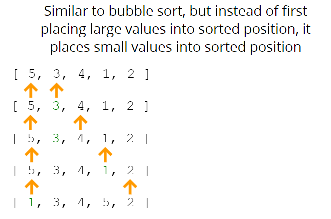

# DSA - JS - Revision

Hi! I'm your first Markdown file in **StackEdit**. If you want to learn about StackEdit, you can read me. If you want to play with Markdown, you can edit me. Once you have finished with me, you can create new files by opening the **file explorer** on the left corner of the navigation bar.

  
  

# Big O Notation

- To analyze the performance of an algorithm, we use Big O Notation

- Big O Notation can give us a high level understanding of the time or space complexity of an algorithm

- Big O Notation doesn't care about precision, only about general trends (linear? quadratic? constant?)

- The time or space complexity (as measured by Big O) depends only on the algorithm, not the hardware used to run the algorithm

  


  

>

  

## Time Complexity

  

**Constants Don't Matter**

  

```

O(2n) O(n)

O(500) O(1)

O(13n^2) O(n^2)

```

  

**Smaller Terms Don't Matter**

```

O(n+1o) O(n)

```

**Big O Shorthands**

```

- Arithmetic operations are constant

- Variable assignment is constant

- Accessing elements in an array (by index) or object (by key) is constant

- In a loop, the the complexity is the length of the loop times the complexity of whatever happens inside of the loop

```

  

## Space Complexity

  

```

- Most primitives (booleans, numbers, undefined, null) are constant space

- Strings require O(n) space (where n is the string length)

- Reference types are generally O(n), where n is the length (for arrays) or the number of keys (for objects)

```

  
  

# Problem Solving Approach

  
  

## UNDERSTAND THE PROBLEM

1. Can I restate the problem in my own words?

2. What are the inputs that go into the problem?

3. What are the outputs that should come from the solution to the problem?

4. Can the outputs be determined from the inputs? In other words, do I have enough information to solve the problem? (You may not be able to answer this question until you set about solving the problem. That's okay; it's still worth considering the question at this early stage.)

5. How should I label the important pieces of data that are a part of the problem?

  

## EXPLORE EXAMPLES

  

- Start with Simple Examples

- Progress to More Complex Examples

- Explore Examples with Empty Inputs

- Explore Examples with Invalid Inputs

  

## BREAK IT DOWN

  
  

## Explicitly write out the steps you need to take.

**This forces you to think about the code you'll write before you write it, and helps you catch any lingering conceptual issues or misunderstandings before you dive in and have to worry about details (e.g. language syntax) as well.**

  
  

## SOLVE THE PROBLEM

  

If you can't...

  

SOLVE A SIMPLER PROBLEM!

  

## SIMPLIFY

- Find the core difficulty in what you're trying to do

- Temporarily ignore that difficulty

- Write a simplified solution

- Then incorporate that difficulty back in

## Look back and Refactor

- Can you check the result?

- Can you derive the result differently?

- Can you understand it at a glance?

- Can you use the result or method for some other problem?

- Can you improve the performance of your solution?

- Can you think of other ways to refactor?

- How have other people solved this problem?

  

# SOME PATTERNS...

  

- Frequency Counter

- Multiple Pointers

- Sliding Window

- Divide and Conquer

- Dynamic Programming

- Greedy Algorithms

- Backtracking

-  **Many more!**

  

[Best Patterns Repo with examples and Images](https://github.com/Chanda-Abdul/Several-Coding-Patterns-for-Solving-Data-Structures-and-Algorithms-Problems-during-Interviews)

  

## Problem Solving Pattern Tips

**Below is a list of some useful tips and patterns that are generally helpful to solve a typical DSA problem. We know that each problem could be mapped to a pattern, and remembering these patterns will surely help you out with the correct problematic approach.**

  
  

- If the given input is sorted, we can use binary search or the two pointer strategy to work out the solution.

- If the problem deals with the top/min/max/closest K elements among given n elements, use a heap to simplify it.

- When you need to try out all combinations( or permutations) of the input (given the constraints are low and suitable enough), use either the Recursive Backtracking algorithm or the Iterative BFS algorithm.

- Most of the problems related to trees and graphs could be solved either through a DFS or BFS approach.

- Every recursive solution can be converted to an iterative solution using stacks.

- If for a problem there exists a brute force solution in O(n^2) time complexity and constant space, then following two can also exist:

1. Using a hashmap or a set for O(n) time and O(n) space.

2. Using sorting for O(nlogn) time and constant space.

- When you have to optimize the solution with problems that could be divided into smaller subproblems, use a DP approach.

- Many optimization problems also demand the knowledge of Binary Search algorithm. So if it occurs to you intuitively, you can surely crack the code within a few mins. Some typical examples include dealing with min/max/at least/at most/largest min/smallest max etc.

- If we need to find some common substring among a set of strings, use a hashmap or a trie(prefix tree)

- When there is a need to search among a bunch of strings, Trie will be the best data structure.

- If problem involves a linked list and we can't use extra space, then usually its related to reversing some part of it or using a Fast and Slow pointer (Hare and Tortoise).

- If O(n) time and O(n) space is to be reduced to O(n) time and constant space, try incorporating the two pointer method.

# Sorting Algorithms

## Bubble Sort


## Time Complexity
Worse case: O(n2)
When the array is reverse-sorted, we iterate through the array (n - 1) times. In the first iteration, we do (n - 1) swaps, (n - 2) in the second, and so on until in the last iteration where we do only one swap. Thus the total number of swaps sum up to n * (n - 1) / 2.

Average case: O(n2)
For a completely random array, the total number of swaps averages out to be around n2 / 4, which is again O(n2).

Best case: O(n)
In the first iteration of the array, if we do not perform any swap, we know that the array is already sorted so stop sorting, therefore the time complexity turns out to be linear.

## Space Complexity
Since we use only a constant amount of additional memory apart from the input array, the space complexity is O(1).

```js
function bubbleSort(arr){
    let swap;
    for(var i=0; i <= arr.length-1 ; i++){
        swap = false
        for(var j=0; j<= arr.length-1 ; j++){
            // compare two values and swap  [10,8,7,11]
            // arr[j]=10
            // arr[j+1]=8
            // 10 > 8 true
            if(arr[j] > arr[j+1]){
                [arr[j],arr[j+1]] =  [arr[j+1],arr[j]]
                swap = true
            }
            // first pass [8,10,7,11]
            // second pass [8,7,10,11]
        }
        // if there are no swaps means array has been sorted already.
        if(swap === false) break
    }
    return arr
}

console.log(bubbleSort([10,8,7,11]))
```


## Selection Sort


## Time Complexity:
Worse case: O(n2)
When we apply insertion sort on a reverse-sorted array, it will insert each element at the beginning of the sorted subarray, making it the worst time complexity of insertion sort.

Average case: O(n2)
When the array elements are in random order, the average running time is O(n2 / 4) = O(n2).

Best case: O(n)
When we initiate insertion sort on an already sorted array, it will only compare each element to its predecessor, thereby requiring n steps to sort the already sorted array of n elements.

## Space Complexity:
Since we use only a constant amount of additional memory apart from the input array, the space complexity is O(1).
```js
function selectionSort(arr){
    for(var i=0; i <= arr.length-1 ; i++){
        var lowest = i
        //compare value in each iteration to determine the min element in array (highlighted green above)
        for(var j=i+1; j <= arr.length-1 ; j++) {
            if(arr[j] < arr[lowest]) lowest = j
        }
        // swap min element with current element i.e whatever at index i
        if(lowest !== i) [arr[lowest],arr[i]] = [arr[i],arr[lowest]]
    }
    return arr
}

console.log(selectionSort([2,1,9,76,4]))
```

## Insertion Sort


```js
function insertionSort(arr){
    // left side of array is sorted to start with index 1 and move everthing smaller to the left side
    for(var i=1; i <= arr.length-1 ; i++){
        var currentVal = arr[i] // 3
        // i=1 , j=0
        for(var j=i-1; j >= 0 ; j--){
        // 5 > 3                                         3         5
          if(arr[j] > currentVal) arr[j+1] = arr[j] // arr[1] = arr[0]
          else break
        }
        // most recent value of j= 0 + 1
        arr[j+1] = currentVal
        // arr[0] becomes 3
        // after first pass [3,5,4,1,2]
    }
    return arr
}
console.log(insertionSort([5,3,4,1,2]))
```


## Merge Sort


## Time Complexity: 
Worst case = Average Case = Best Case = O(n log n)

Merge sort performs the same number of operations for any input array of a given size.

In this algorithm, we keep dividing the array into two subarrays recursively which will create O(log n) rows where each element is present in each row exactly once. 

For each row, it takes O(n) time to merge every pair of subarrays. So the overall time complexity becomes O(n log n).

## Space Complexity: 
Since we use an auxiliary array of size at most n to store the merged subarray, the space complexity is O(n).

```js
function merge(arrOne,arrTwo){
    let result = []
    let i = 0
    let j = 0
    while(i < arrOne.length && j < arrTwo.length){
        if(arrOne[i] < arrTwo[j]){
            result.push(arrOne[i])
            i++
        }else{
            result.push(arrTwo[j])
            j++
        }
    }
    while(i < arrOne.length){
        result.push(arrOne[i])
        i++
    }
    while(j < arrTwo.length){
        result.push(arrTwo[j])
        j++
    }

    return result
}

function mergeSort(arr){
    if(arr.length <= 1) return arr
    let mid = Math.floor(arr.length/2)
    let left = mergeSort(arr.slice(0,mid))
    let right = mergeSort(arr.slice(mid))
    return merge(left,right)
}
console.log(mergeSort([1,10,50,2,14,99,100]))
```

## Quick Sort


## Time Complexity:
Worse case: O(n2)
When the array is sorted and we choose the leftmost element as pivot, or the array is reverse-sorted and we choose the rightmost element as pivot, the time complexity becomes quadratic since partitioning the array results in highly unbalanced subarrays in such cases.

Also when there are a large number of identical elements in the array, optimal partitioning becomes hard, resulting in quadratic time complexity.

Average case and best case: O(n log n)
The best case for quick-sort happens when we successfully pick the median element for partitioning every time. Such partitioning allows us to divide the array in half every time. 

We can avoid the worst-case in quicksort almost always by choosing an appropriate pivot. There are various ways to achieve this:

Pick the pivot from the middle of the array
Adopt a random selection of pivots
Take the median of three pivot candidates, i,e., choose the median of the first, middle, and the last elements of the array as the pivot. 
These methods result in almost equal partitioning of the array, on average. This way the average case time complexity of quicksort practically becomes O(n log n).

## Space Complexity:
Although quicksort doesn’t use auxiliary space to store array elements, additional space is required for creating stack frames in recursive calls. 

Worst case: O(n)
This happens when the pivot element is the largest or smallest element of the array in every recursive call. The size of the subarray after partitioning will be n-1 and 1. In this case, the size of the recursive tree will be n. 

Best case: O(log n)
This happens when the pivot element’s correct position in the partitioned array is in the middle every time. The size of subarrays will be half the size of the original array. In this case, the recursive tree’s size will be O(log n). 

```js
function pivot(arr,start=0,end=arr.length-1){
    let pivot = arr[start] // 12
    let swapIndex = start // 0
    for(var i=start+1; i<= end; i++){
        // 1st pass: 3 < 12
        // 5th pass: 5 < 12 
        if(arr[i] < pivot){
            swapIndex++ // 1 , 2
            // 1st pass:  swap index and i same 1=1 not swapping [12,3,44,....]
            // 2nd pass: swapped 5 and 44 [12,3,5,38,44,...]
            [arr[swapIndex],arr[i]] = [arr[i],arr[swapIndex]] 
        }
    }
    // 1st pass:  finally since there were only three numbers smaller than pivot at index 0 (12) i.e 3,5 and 9 so swapindex will be 3
    [arr[swapIndex],arr[start]] = [arr[start],arr[swapIndex]]
    return swapIndex
}


function quickSort(arr,left=0,right= arr.length-1){
    // pivot can be random here it is first element always
    if(left < right){
        let pivotIndex = pivot(arr,left,right)
        quickSort(arr,left,pivotIndex-1)
        quickSort(arr,pivotIndex+1,right)
    }
   return arr
}
console.log(quickSort([12,3,44,38,5,47,15,9]))
```

